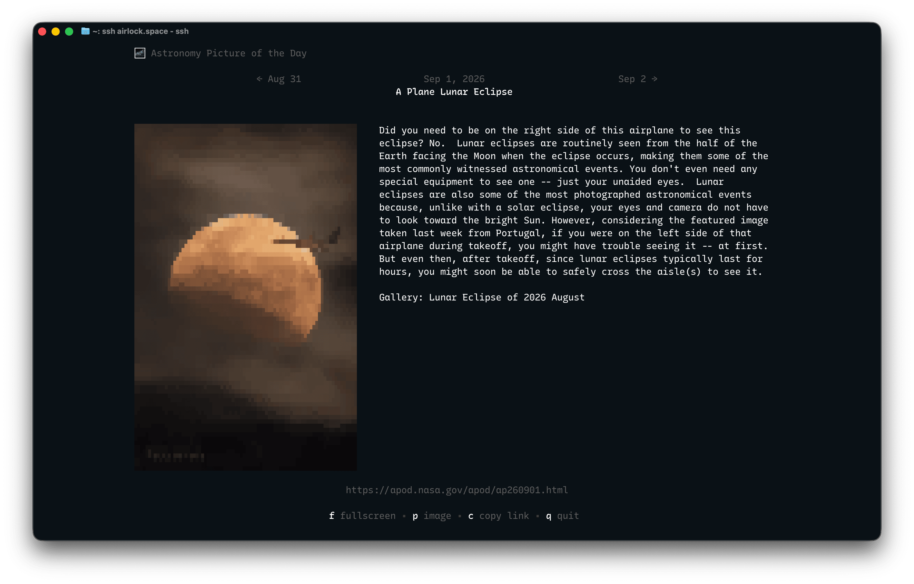
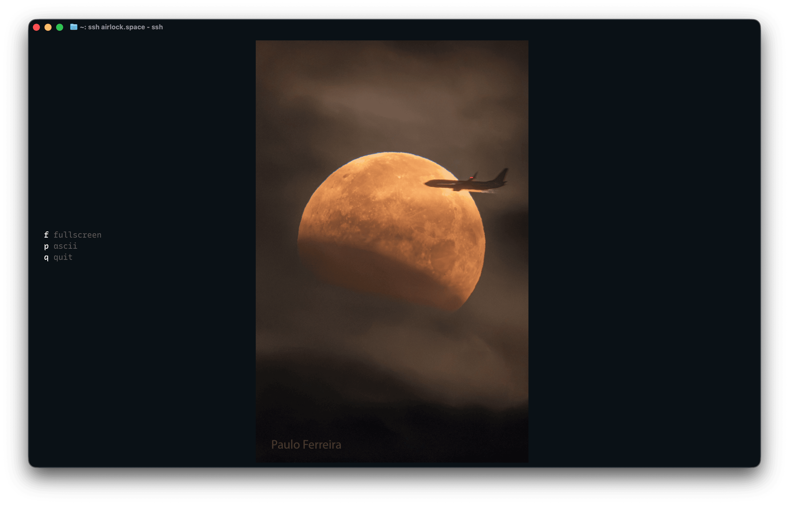

# airlock.space

NASA's [Astronomy Picture of the Day](https://apod.nasa.gov/apod/) served to your terminal as a TUI over SSH.

```sh
ssh airlock.space   # no installation needed :)
```


<p align="center">
  
</p>

Terminals that speak the kitty graphics protocol (kitty, Ghostty) get the real
photograph.

<p align="center">
  
</p>

## Running locally

```sh
NASAKEY=... go run ./cmd/airlockspace
```

`NASAKEY` is your [NASA API key](https://api.nasa.gov/). Without one it falls
back to NASA's shared `DEMO_KEY`, which is severely rate-limited. Obtaining a
key from NASA takes two minutes -- highly recommended :)

## Self-hosting

### NixOS

Nix package, NixOS module, socket activation, and systemd credentials: [NixOS deployment](docs/nixos-deployment.md).

### systemd

* `airlocksshd` runs as a systemd service with `DynamicUser=yes` - a transient unprivileged user.
* `airlocksshd.socket` allow systemctl to bind to port 22 and hand the listener over to airlocksshd
without granting it elevated privileges.

Move your ssh server to another port (`/etc/ssh/sshd_config`) or change airlock's port in `airlocksshd.socket`.

### Installation

Compile and transfer to the host: 

```sh
GOOS=linux GOARCH=amd64 go build -o airlocksshd ./cmd/airlocksshd
scp airlocksshd root@your-host:/opt/airlocksshd
scp deploy/airlocksshd.{service,socket} root@your-host:/etc/systemd/system/
```

On the host: 

```sh
echo 'NASAKEY=...' > /etc/airlocksshd.env && chmod 600 /etc/airlocksshd.env
systemctl daemon-reload && systemctl enable --now airlocksshd.socket
```

Redeploys are `scp` the new binary over, then `systemctl restart airlocksshd`;
the socket keeps listening across the restart.

Without systemd, run `airlocksshd` however you like. It:

* falls back to binding to `SSH_HOST`:`SSH_PORT` itself (`localhost:23234`)
* keeps its host key at `SSH_HOST_KEY` (`.airlocksshd/id_ed25519`, generated on first start)
* caches source images under `STATE_DIRECTORY` or your user cache dir
